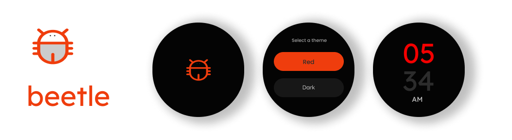

# beetle
# Wear OS Jetpack Compose App

This is a Wear OS Jetpack Compose app that showcases various features and functionalities. The app follows the MVVM (Model-View-ViewModel) architecture and utilizes several libraries and tools including Ktor, Koin, and Wear OS.

## Features

### Implemented Features
- **Jetpack Compose UI**: Utilizes the modern Jetpack Compose framework for building UI elements, providing a sleek and responsive user interface.
- **MVVM Architecture**: Follows the MVVM architectural pattern for separation of concerns, making the app modular and easier to maintain.
- **Ktor**: Utilizes Ktor for making network requests, ensuring efficient and asynchronous communication with remote servers.
- **Koin**: Implements dependency injection using Koin, simplifying the management of dependencies and promoting code reusability.
- **Wear OS Integration**: Built specifically for Wear OS, providing a tailored experience for users on smartwatches.
- **Network Request**: Performs network requests to fetch data from remote servers, enhancing the app's functionality with real-time data updates.

### Upcoming Features (TODO)

- **Tile Service**: Implement Tile Service to allow users to interact with the app directly from the Wear OS home screen.
- **Ongoing Notification**: Display ongoing notifications to provide users with timely updates and reminders.
- **Watch Face with Watch Face Studio**: Create a customizable watch face using Watch Face Studio, enhancing the personalization options for users.

## Usage

To use the app, simply install it on your Wear OS device. Navigate through the intuitive user interface to access different features and functionalities. Stay tuned for upcoming updates with new features!

## Contributing

Contributions to the project are welcome! If you have any suggestions, bug reports, or feature requests, please feel free to open an issue or submit a pull request.

## License

This project is licensed under the MIT License - see the [LICENSE](LICENSE) file for details.

